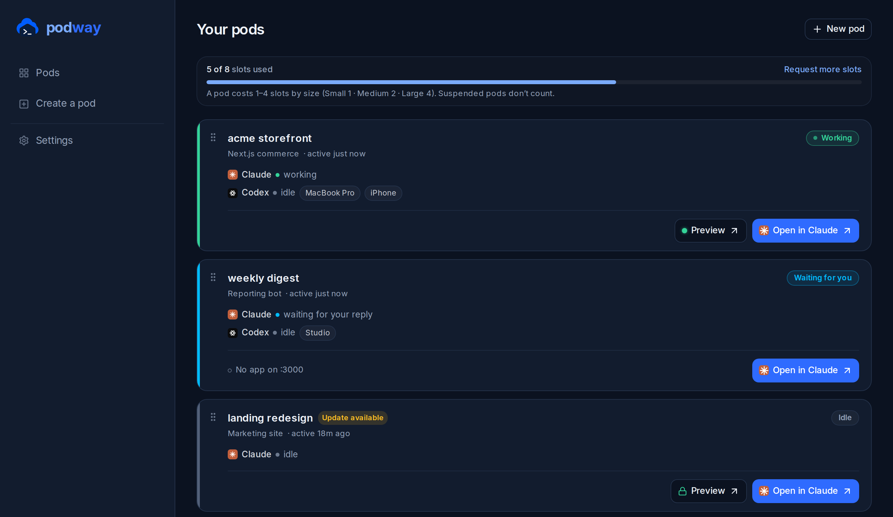

<div align="center">

# podway

**Give Claude a persistent computer on your own hardware.**

Podway runs Claude Code in a persistent workspace with your project, tools, databases, services,
and recurring work. Sign in once, then continue the same pod from the official Claude apps on
desktop or mobile, using the Claude Pro or Max subscription you already have.

Self-host it in one command, or use the managed service at
[podway.cloud](https://podway.cloud).

[](LICENSE)
[](#quickstart-self-host)

<br>



</div>

## Why podway

The official Claude apps already provide the interface. Podway gives Claude the persistent computer
behind it.

- **Use Claude where you already do.** Continue your pod from the official Claude desktop or mobile
  app, with the same interface and Claude subscription you already know.
- **Keep your working environment intact.** Your repository, dependencies, tools, and files remain
  available between sessions.
- **Run the whole project.** Claude can work with development servers, databases, background workers,
  scheduled jobs, monitors, and project-specific skills, not just edit files.
- **Open what Claude builds.** Apps running in a pod receive a preview you can open or share.
- **See when you are needed.** The dashboard shows which agents are working, idle, or waiting for
  your reply.
- **Keep control of the machine.** Self-hosted pods run as Docker containers on your own computer or
  server.

## Quickstart (self-host)

You need **Docker** (Desktop or Engine + Compose v2), ~**8 GB RAM**, ~**6 GB disk**, and a
**Claude Pro or Max subscription**. Works on macOS, Linux, and WSL2.

```sh
curl -fsSL podway.io/install.sh | sh
```

The installer checks your machine, writes a Docker Compose setup into `./podway`, pulls the prebuilt
images, and prints **the real URL for your setup**, auto-detected from where it runs:

- **Laptop / private box** → `http://localhost:8080`
- **Public server, no domain** → automatic HTTPS at `https://<your-ip>.sslip.io` (each pod gets its own
  `https://<pod>.<your-ip>.sslip.io` preview)
- **Your domain** → `https://podway.<your-domain>` (two DNS records)

When installation finishes:

1. Open the URL printed by the installer.
2. Create your owner account and your first pod.
3. Sign in with your Claude account.
4. Continue the pod from the official Claude desktop or mobile app.

From then on, Claude is the main interface. Return to the Podway dashboard to create or manage pods,
add secrets, inspect health, and open app previews. A browser terminal remains available as an
advanced recovery tool.

No repository clone or local build is required. The installer pulls prebuilt images. Prefer to build
them yourself? See [Build from source](#build-from-source).

## What you get

| | |
|---|---|
| **Claude apps** | continue pod sessions from the official Claude desktop and mobile apps |
| **Persistent pods** | keep each project's files, dependencies, tools, and services together |
| **Development environment** | run databases, dev servers, workers, and other project services |
| **Ongoing work** | schedule recurring agent jobs and monitor the work that matters to you |
| **App previews** | open or share the application running on port `:3000` |
| **Dashboard** | create, observe, update, and suspend pods; add secrets and inspect health |

Podway also supports Codex for people who want to use both agents.

## Build from source

The prebuilt images are the default. To build your own (air-gapped, customized, or latest `main`):

```sh
git clone https://github.com/podway-cloud/podway.git && cd podway
# build the pod-base image (the pod runtime) and the app image, then run the compose stack
./selfhost/build-images.sh          # multi-arch build → your registry
# ...then point the compose at your images (see selfhost/)
```

See [`selfhost/`](selfhost/) for the compose file, environment variables, and the deployment guide.

## What's in this repo

A pnpm monorepo:

- **`packages/pod-agent`**: the in-pod runtime (terminal bridge, supervisor/watchdog, the in-pod
  `podway` CLI, dev-server management).
- **`packages/provider`**: the pod backend behind one interface (`local` = Docker for self-host);
  **`packages/provider/pod-base`** is the image (Dockerfile, init, CLI, skills).
- **`packages/control-plane`**: the pod lifecycle service (single-tenant for self-host).
- **`packages/gateway`**: the terminal/preview link.
- **`packages/db`**, **`packages/auth`**, **`packages/shared`**, **`packages/selfhost`**: schema
  (Postgres/PGlite), single-owner auth, shared schemas, the self-host serve daemon.
- **`apps/web`**: the dashboard (one edition-aware app).
- **`environments/`**, **`skills/`**: workspace templates and the agent skill/rule layer.

## Managed cloud

Don't want to run infrastructure? [**podway.cloud**](https://podway.cloud) is the hosted version: the
same runtime, plus a managed fleet, team features, and a residential-egress relay network.

## License

podway is **[Business Source License 1.1](LICENSE)**: free to self-host for yourself or your
organization, and it **converts to Apache-2.0 three years** after each release. The one restriction is
offering podway as a competing hosted service. Plain-English summary: [`LICENSING.md`](LICENSING.md).

## Contributing & security

- Contributions welcome. See [`CONTRIBUTING.md`](CONTRIBUTING.md) (PRs are validated upstream; a DCO
  sign-off is required).
- Found a vulnerability? Please report it privately. See [`SECURITY.md`](SECURITY.md).
