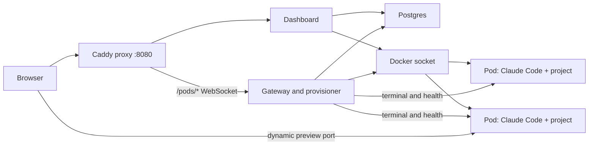

# Podway Self-Hosted architecture

Podway Self-Hosted is a single-operator control plane that creates one Docker container for each
agent workspace, called a pod.

## Compose services

| Service | Responsibility |
|---|---|
| `proxy` | Caddy front door for dashboard HTTP and authenticated terminal WebSockets |
| `web` | Next.js dashboard and server actions |
| `serve` | Terminal gateway, pod provisioning loop, and health reconciliation |
| `db` | Postgres state store |
| `migrate` | One-shot database migration during startup |
| `podbase` | Pulls and caches the pod image so the first pod launch does not begin with that pull |

Pods are not Compose services. The dashboard and provisioner create them as sibling containers by
using the host Docker socket. They join the `podway-pods` Docker network so the gateway can reach
each pod agent by container name.

## Data locations

- `podway_pgdata` holds Postgres data.
- `podway_appdata` holds the secret-vault key and app-owned persistent data.
- Each pod's writable container filesystem holds its project workspace.

Deleting a pod removes its writable container filesystem. Pod files are deliberately not hidden in
the database or copied into the Compose volumes.

## Images

- `ghcr.io/podway-cloud/pod-app` contains the dashboard, self-host entrypoint, control plane, gateway, and
  their workspace dependencies.
- `ghcr.io/podway-cloud/pod-base` is the development environment launched for each pod. It contains the
  pod agent, Claude Code, Codex pilot support, development tools, and environment templates.

Both images are published for AMD64 and ARM64. The current installer pulls `latest`; digest pins
can be supplied through the environment variables documented in [Deployment](DEPLOYMENT.md).

## Trust boundaries

The `web` and `serve` containers mount `/var/run/docker.sock`. Anyone who controls those services,
or can perform privileged actions through the owner account, can effectively control the Docker
host. The dashboard and terminal share one signed owner session; this edition assumes one trusted
operator and is not a multi-tenant security boundary.

Pods isolate project dependencies from one another, but they run on the same Docker daemon and use
the host's network connection. See [Security](SECURITY.md) for the current limits.
